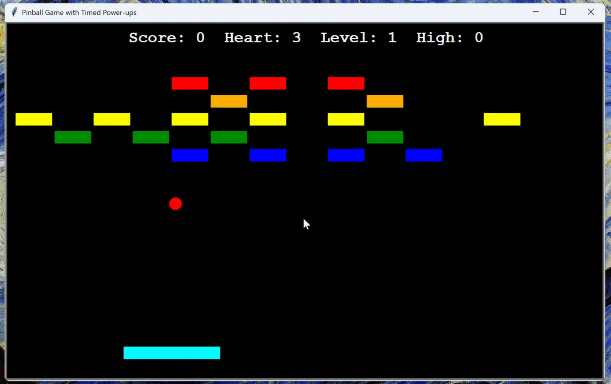

# Python-Pinball-Game

A fun and interactive Pinball game built with Python, Turtle, and Pygame. Bounce the ball off the paddle to destroy bricks, collect power-ups, and advance through increasingly challenging levels.

## Features

* Multiple levels with randomly generated brick layouts.
* Bricks with different HP: normal (1 hit) and strong (2 hits).
* Power-ups: paddle enlargement, extra life, slow ball, extra ball.
* Lives, score, level tracking, and high score saved locally.
* Smooth paddle movement using keyboard input.
* Real-time collision detection with bricks, walls, and paddle.
* Sound effects for bouncing, brick breaking, power-ups, level up, and game over.

## Installation

1. Clone the repository:

```bash
git clone https://github.com/pathipat11/Python-Pinball-Game.git
```

2. Navigate to the project directory:

```bash
cd Python-Pinball-Game
```

3. Install required packages:

```bash
pip install pygame
```

## Usage

1. Place the `assets` folder (sounds, images if any) in the project folder.
2. Run the game:

```bash
python main.py
```

3. Controls:

   * Arrow Left / Right: Move paddle
   * Space: Launch ball / Start level
   * P: Pause / Resume
   * R: Restart game

4. Try to destroy all bricks while keeping your balls alive.

## 🎬 Demo Video



## Contributing

Contributions are welcome! Feel free to submit a pull request or open an issue.

## Author

**Pathipat Mattra**

* 🌐 Facebook: [Pathipat Mattra](https://facebook.com/pathipat.mattra)
* 💻 GitHub: [pathipat11](https://github.com/pathipat11)
* 💼 LinkedIn: [Pathipat Mattra](https://linkedin.com/in/viixl)
